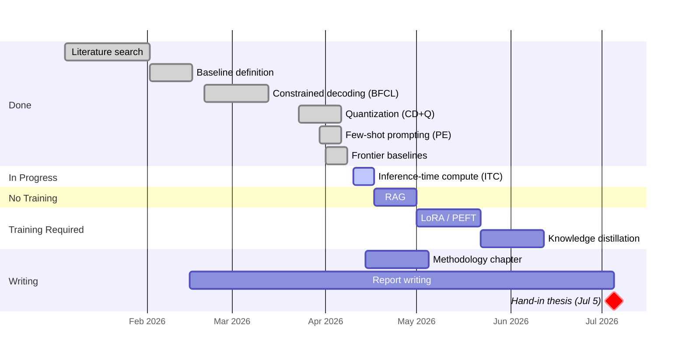

# Agents with Small Language Models

DTU Master Thesis · Supervisor Meeting

**Paulo Beckhauser** · s242779 · Supervisor: Nicki · April 13, 2026

---
layout: section
---

# Progress

## Phase 1 no-retraining configs

---

# Where we left off on March 16

- **Constrained decoding PoC** on Qwen 2.5 3B was in progress
- Full BFCL evaluation had not yet run
- Plan was: finish CD, then Prompt Engineering, then Inference-Time Compute, then RAG, then LoRA

**Since then:** switched the primary model to **Qwen 2.5 7B Instruct** for a stronger baseline, built a vLLM-based harness, and closed four of the no-retraining configs on BFCL v4 simple_python.

---

# Results so far — BFCL v4 simple_python (400 cases)

| Config | Accuracy | Correct | Delta vs CD | Notes |
|--------|----------|---------|-------------|-------|
| **B** (no guided) | 1.5% | 6/400 | −71.25 pp | Raw model cannot structure output |
| **CD** (guided) | 72.75% | 291/400 | baseline | Guided decoding fixes format |
| **CD+Q** (AWQ INT4) | 72.0% | 288/400 | −0.75 pp | Quantization is effectively free |
| **PE** (few-shot + guided) | 70.25% | 281/400 | −2.5 pp | **Negative result** |
| **CD+Q+ITC** (CoT) | running | — | — | Job submitted, results Monday AM |
| **CD+Q+RAG** | — | — | — | Next config |

**Model memory drops 63.5%** (14.25 GiB → 5.20 GiB) with quantization, no meaningful accuracy loss.

---

# Three headline findings

- **Constrained decoding is the whole game for format.** 1.5% → 72.75% just from guided decoding. Not surprising, but now quantified.

- **Quantization is effectively free.** AWQ INT4 costs 0.75 pp and saves 63.5% VRAM. Qwen 2.5 7B quantized runs comfortably on an RTX 4090 — the deployment-viable configuration.

- **Prompt engineering did not help.** Few-shot examples targeting known failure modes (numeric precision, unit format, optional defaults) *reduced* accuracy by 2.5 pp. The errors are learned associations, not format gaps.

---

# Why prompt engineering failed

Failures in Config CD split into two classes:

**Reasoning-visible errors**
- 9.8 vs 9.81 (numeric precision)
- `x**2` vs `x^2` (Python syntax)
- `[1,3]` vs `[1.0,3.0]` (nested types)

*The model could have been right if it externalized its thinking before committing.*

**Learned-association errors**
- "km/h" vs "kilometers per hour"
- "New York" vs "New York, NY"
- `root_type=''` vs `'all'`

*No prompt changes these — they are in the model's prior.*

**Implication**: This framing motivates CoT (tests whether reasoning-visible errors can be fixed by reasoning) and then LoRA (the only path to change learned associations).

---

# Frontier baselines established

- **GPT backend** (`src/frontier_backend.py`) — running via OpenAI API
- **Claude backend** — running via Anthropic API
- Both plug into the same BFCL adapter as the SLM path

These give the **ceiling** for the thesis comparison. The thesis story is: *how much of the gap between the SLM and the frontier can cumulative no-retraining optimizations close, and how much must come from training?*

---
layout: statement
---

# The running picture

Two prompt-only techniques tested. Both fail on the argument-extraction failure class.

**If CD+Q+ITC also fails on Monday, the thesis case for LoRA is effectively written.**

---
layout: section
---

# Problems

## Where I need your input

---

# Q1 — Evidence for LoRA

If Config CD+Q+ITC (CoT) also regresses on Monday, that is **two out of two** prompt-only techniques failing on argument-extraction errors.

- ❓ Is that strong enough evidence in a thesis to commit hard to LoRA as *the* answer for RQ2?
  A:

- ❓ Or would you want a third prompt-only data point first — e.g. longer CoT with explicit format-rule elicitation, or a self-consistency sample?
  A:

---

# Q2 — ReAct scope on Phase 1

On BFCL simple_python, ReAct degenerates to CoT: one function, no tool execution, no observation step, no iteration. A "ReAct run" is exactly one Thought → one Action → stop.

- ❓ Do you agree Phase 1 can defend "ITC ≈ CoT on single-call BFCL" as sufficient?
  A:

- ❓ Or should τ-bench be pulled forward in the schedule so ReAct gets a distinct multi-turn evaluation *before* LoRA?
  A:

---

# Q3 — The ceiling gap

Spec target: ≥85% AST accuracy. Current best: **72.0%** (CD+Q).

- ❓ The 13 pp gap has to come almost entirely from LoRA. Is that realistic for Qwen 2.5 7B on the **Glaive function-calling dataset**?
  A:

- ❓ Would you recommend a different training source — Claude Opus distillation traces, BFCL train split, or synthetic data?
  A:

---

# Q4 — Breadth vs depth

- ❓ Default plan is depth-first: stay on Qwen 2.5 7B and go LoRA → distillation → RAG. Second models (Phi-4 Mini, Llama 3.2) come only if time permits.
  A:

- ❓ Alternative: add Phi-4 Mini and Llama 3.2 as breadth data points now (Issue #16), on the existing no-retraining stack, before starting LoRA. More data for RQ1, less time for training.
  A:

---

# Q5 — Writing cadence

Phase 1 methods are now frozen (CD, CD+Q, PE, ITC, RAG all specified). The Methodology chapter can be drafted from `docs/decisions/` without waiting for LoRA.

- ❓ Start the Methodology outline this week and bring a draft to the next meeting?
  A:

- ❓ Or wait until Phase 2 is also done so methodology and results are written together?
  A:

---
layout: section
---

# Plan

## Next ~2 weeks

---

# Immediate next steps

- **This week**: Land CD+Q+ITC results doc and PR (blocks on Monday's job output).
- **This week**: Submit Config CD+Q+RAG (Issue #7) — closes Phase 1.
- **Next week**: Phase 2 data prep (Issue #9) — BFCL train/test splits + Glaive dataset formatting.
- **In parallel, pending Q5**: Start Methodology chapter outline from `docs/decisions/`.

**Milestones:**
- Phase 1 fully complete and documented — ~2026-04-20
- First LoRA training run — ~2026-04-27

---

# Timeline

---
layout: statement
---

# Thank you

Agenda: `docs/supervision/2026-04-13-agenda.md`
Pre-read: `docs/decisions/config-pe-few-shot-results.md`, `config-cdq-itc-spec.md`
