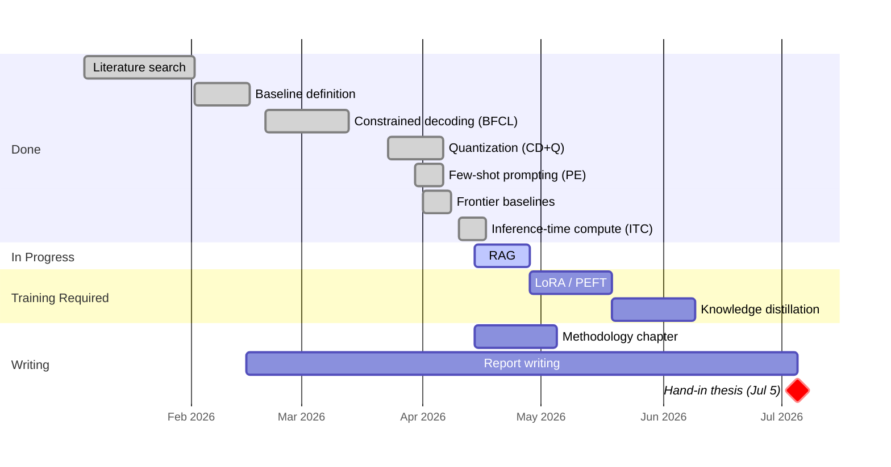

# Agents with Small Language Models

DTU Master Thesis · Supervisor Meeting

**Paulo Beckhauser** · s242779 · Supervisor: Nicki · April 13, 2026

---
layout: section
---

# Progress

## Phase 1 no-retraining configs

---

# Where we left off on March 16

- **Constrained decoding PoC** on Qwen 2.5 3B was in progress
- Full BFCL evaluation had not yet run
- Plan was: finish CD, then Prompt Engineering, then Inference-Time Compute, then RAG, then LoRA

**Since then:** switched the primary model to **Qwen 2.5 7B Instruct** for a stronger baseline, built a vLLM-based harness, and closed four of the no-retraining configs on BFCL v4 simple_python.

---

# Results so far — BFCL v4 simple_python (400 cases)

| Config | Accuracy | Correct | Delta vs CD+Q | Notes |
|--------|----------|---------|---------------|-------|
| **B** (no guided) | 1.5% | 6/400 | −70.5 pp | Raw model cannot structure output |
| **CD** (guided) | 72.75% | 291/400 | +0.75 pp | Guided decoding fixes format |
| **CD+Q** (AWQ INT4) | **72.0%** | **288/400** | **baseline** | Quantization is effectively free |
| **PE** (few-shot) | 70.25% | 281/400 | −1.75 pp | **Negative** |
| **CD+Q+ITC** (CoT) | **65.5%** | **262/400** | **−6.5 pp** | **Strongly negative** |
| **CD+Q+RAG** | — | — | — | Next config |

**Model memory drops 63.5%** (14.25 GiB → 5.20 GiB) with quantization, no meaningful accuracy loss. The no-training ceiling is **CD+Q at 72.0%**.

---

# Four headline findings

- **Constrained decoding is the whole game for format.** 1.5% → 72.75% just from guided decoding.

- **Quantization is effectively free.** AWQ INT4 costs 0.75 pp and saves 63.5% VRAM. Runs on an RTX 4090.

- **Prompt engineering did not help.** Few-shot examples *reduced* accuracy by 1.75 pp.

- **CoT made things substantially worse.** −6.5 pp. Flip analysis: **24 gains, 50 losses**. The reasoning traces show CoT is not failing silently — it is *arguing itself into the wrong answer*.

---

# CoT broke the model

Six loss cases — the reasoning trace is the model arguing itself into the wrong answer.

| ID | CD+Q (correct) | CD+Q+ITC (wrong) | What CoT wrote |
|---|---|---|---|
| 127 | `discount_rate=0.1` | `discount_rate=10.0` | *"the discount rate is in percentage form"* |
| 139 | `yearly_yield=5.0` | `yearly_yield=0.05` | *"5% yearly yield ... estimate_mutual_fund_return(0.05, ...)"* |
| 147 | `'2 weeks'` | `'last 2 weeks'` | *"needs to be preserved exactly as a string"* |
| 168 | `'01/01/2021'` | `'2021-01-01'` | *"start_date: '2021-01-01'"* (ISO default) |
| 200 | `'gas'` | `'gasoline'` | *"Gasoline would be the fuel type"* |
| 203 | `detail=True` | `detail=False` | *"assume 'detail' is False by default"* |

**Pattern**: CoT produces the linguistically natural or most defensible value. BFCL ground truths encode arbitrary conventions. These disagree, and CoT loses.

---

# Why CoT backfires

- **Drift.** The `max_tokens=256` reasoning block turns into Python pseudocode, quadratic-formula derivations, and justification paragraphs. Reasoning drifts away from the extraction task.

- **Self-injection.** Once CoT commits to a value in the reasoning text ("discount_rate = 10"), the guided JSON extraction inherits that value. The reasoning becomes a prompt injection against itself.

- **Natural language beats arbitrary convention.** BFCL encodes specific, often arbitrary forms. CoT defaults to the form a thoughtful human would write, not the form a dataset happens to label correct.

**Takeaway**: Prompting cannot move the model's *internal* association between a function context and a specific value form. Only training can.

---

# Frontier baselines established

- **GPT backend** (`src/frontier_backend.py`) — running via OpenAI API
- **Claude backend** — running via Anthropic API
- Both plug into the same BFCL adapter as the SLM path

These give the **ceiling** for the thesis comparison. The thesis story is: *how much of the gap between the SLM and the frontier can cumulative no-retraining optimizations close, and how much must come from training?*

---
layout: statement
---

# The running picture

Two prompt-only techniques tested. Both fail on the argument-extraction failure class.

- PE: **−1.75 pp**
- CoT: **−6.5 pp**

**The case for LoRA is written.**

---
layout: section
---

# Problems

## Where I need your input

---

# Q1 — Evidence for LoRA

Two prompt-only techniques have now failed:

- PE: **−1.75 pp**
- CoT: **−6.5 pp**

The CoT reasoning traces also give a mechanistic explanation — reasoning reinforces linguistically natural values, which do not match BFCL's arbitrary conventions.

- ❓ Is this enough evidence in a thesis to commit hard to LoRA as *the* answer for RQ2?
  A:

- ❓ Or would you want a third prompt-only data point first — e.g. self-consistency sampling, or CoT with an explicit BFCL-style style guide in the prompt?
  A:

---

# Q2 — ReAct scope on Phase 1

On BFCL simple_python, ReAct degenerates to CoT: one function, no tool execution, no observation step, no iteration. A "ReAct run" is exactly one Thought → one Action → stop.

- ❓ Do you agree Phase 1 can defend "ITC ≈ CoT on single-call BFCL" as sufficient?
  A:

- ❓ Or should τ-bench be pulled forward in the schedule so ReAct gets a distinct multi-turn evaluation *before* LoRA?
  A:

---

# Q3 — The ceiling gap

Spec target: ≥85% AST accuracy. Current best: **72.0%** (CD+Q).

- ❓ The 13 pp gap has to come almost entirely from LoRA. Is that realistic for Qwen 2.5 7B on the **Glaive function-calling dataset**?
  A:

- ❓ Would you recommend a different training source — Claude Opus distillation traces, BFCL train split, or synthetic data?
  A:

---

# Q4 — Breadth vs depth

- ❓ Default plan is depth-first: stay on Qwen 2.5 7B and go LoRA → distillation → RAG. Second models (Phi-4 Mini, Llama 3.2) come only if time permits.
  A:

- ❓ Alternative: add Phi-4 Mini and Llama 3.2 as breadth data points now (Issue #16), on the existing no-retraining stack, before starting LoRA. More data for RQ1, less time for training.
  A:

---

# Q5 — Writing cadence

Phase 1 methods are now frozen (CD, CD+Q, PE, ITC, RAG all specified). The Methodology chapter can be drafted from `docs/decisions/` without waiting for LoRA.

- ❓ Start the Methodology outline this week and bring a draft to the next meeting?
  A:

- ❓ Or wait until Phase 2 is also done so methodology and results are written together?
  A:

---
layout: section
---

# Plan

## Next ~2 weeks

---

# Immediate next steps

- **This week**: Land CD+Q+ITC results doc and PR (blocks on Monday's job output).
- **This week**: Submit Config CD+Q+RAG (Issue #7) — closes Phase 1.
- **Next week**: Phase 2 data prep (Issue #9) — BFCL train/test splits + Glaive dataset formatting.
- **In parallel, pending Q5**: Start Methodology chapter outline from `docs/decisions/`.

**Milestones:**
- Phase 1 fully complete and documented — ~2026-04-20
- First LoRA training run — ~2026-04-27

---

# Timeline

---
layout: statement
---

# Thank you

Agenda: `docs/supervision/2026-04-13-agenda.md`
Pre-read: `docs/decisions/config-pe-few-shot-results.md`, `config-cdq-itc-spec.md`
