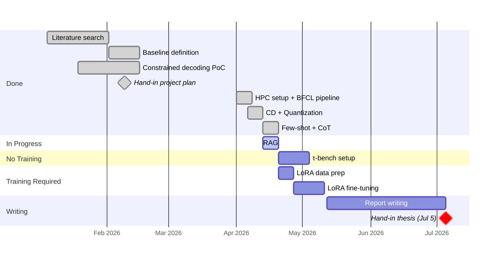

# Agents with Small Language Models

DTU Master Thesis · Supervisor Meeting

**Paulo Beckhauser** · s242779 · Supervisor: Nicki · April 13, 2026

---

# What am I doing?

SLMs can't call tools reliably out of the box. I am testing some techniques in order to improve that.

- **Model**: Qwen 2.5 7B Instruct
- **Benchmark**: BFCL (400 single-function calls)
- **Task**: given a user query + function schema, produce the correct call

A small model handles simple tool calls, and a frontier model (e.g. GPT-4.1) takes over when the SLM fails. The goal is to expand the boundary of what the SLM can handle reliably, reducing how often the expensive fallback is needed.

| Query | Expected call |
|---|---|
| *"What is the GCD of 12 and 15?"* | `math.gcd(num1=12, num2=15)` |
| *"Find pediatrics hospitals within 5 miles of Denver"* | `hospital.locate(location='Denver, Colorado', radius=5, department='pediatrics')` |

---

# Results so far

| Config | Accuracy | Correct |
|--------|----------|---------|
| No guided decoding | 1.5% | 6/400 |
| Constrained decoding | 72.75% | 291/400 |
| + Quantization (AWQ INT4) → baseline | **72.0%** | 288/400 |
| + Few-shot prompting | 70.25% | 281/400 |
| + Chain-of-thought | 65.5% | 262/400 |
| + RAG | next | |
| + LoRA | planned | |
| + LoRA + CoT/ReAct | planned | |
| + LoRA + RAG | planned | |
| + LoRA + CoT/ReAct + RAG | planned | |

Constrained decoding does almost everything. Quantization saves 63.5% VRAM for free. Both prompt techniques made things worse.

---

# Frontier comparison (BFCL Simple AST)

Qwen 2.5 7B with constrained decoding already matches frontier models on single-function calls.

| Model | Accuracy |
|-------|----------|
| Gemini 3 Pro (Prompt) | 79.58% |
| Claude Opus 4.5 (FC) | 76.83% |
| Grok 4.1 Fast (FC) | 77.58% |
| GPT-4.1 (FC) | 72.67% |
| **Qwen 2.5 7B + CD** | **72.75%** |
| Claude Sonnet 4.5 (FC) | 72.58% |
| Claude Haiku 4.5 (FC) | 71.00% |

Constrained decoding closes the format gap on the simplest slice of the benchmark (synthetic schemas, single function, one turn). Frontier models pull ahead on harder categories (multi-turn, agentic, live APIs).

<small>Source: <a href="https://gorilla.cs.berkeley.edu/leaderboard.html" target="_blank">BFCL v4 leaderboard</a>, Single Turn → Non-live (AST) column, April 2026</small>

---

# Chain-of-Thought is actively harmful

Chain-of-Thought (CoT) prompts the model to "think step by step" before answering. Flip analysis: 24 gains, 50 losses. The model reasons itself into the wrong answer.

| Without CoT (correct) | With CoT (wrong) | What CoT wrote |
|---|---|---|
| `discount_rate=0.1` | `discount_rate=10.0` | *"the discount rate is in percentage form"* |
| `yearly_yield=5.0` | `yearly_yield=0.05` | *"5% yearly yield ... (0.05)"* |
| `'01/01/2021'` | `'2021-01-01'` | *"start_date: '2021-01-01'"* (ISO default) |
| `'gas'` | `'gasoline'` | *"Gasoline would be the fuel type"* |

When the model reasons step by step, it activates its world knowledge: it "knows" that discount rates are percentages, that dates should be ISO formatted, that "gas" is short for "gasoline". So it converts the values to what makes sense, instead of passing them exactly as the user wrote them. The benchmark expects the literal value from the query, not an interpreted one.

---

# Questions for Nicki

- I found in [Sune Lehmann's writing guide](https://sunelehmann.com/how-to-write-a-masters-thesis/) that I should write in active voice. Should/Could I follow that for the thesis?

- Definitions: presentation will be remote. I will deliver before July 5th. Should I send the thesis to you before submission?

---

# Next steps

- RAG config (closes Phase 1)
- LoRA training data prep (BFCL splits + Glaive dataset)
- LoRA fine-tuning
- τ-bench setup for multi-turn agentic evaluation

---
layout: statement
---

# Thank you
