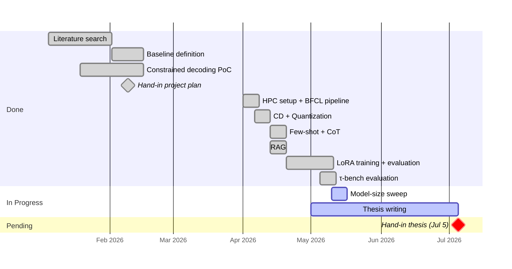

# Agents with Small Language Models

DTU Master Thesis · Supervisor Meeting

**Paulo Beckhauser** · s242779 · Supervisor: Nicki · May 11, 2026

---

# Seven techniques tested to expand the boundary of reliable SLM tool calling

SLMs can't call tools reliably out of the box. I am testing some techniques in order to improve that.

- **Models**: Qwen 2.5 Instruct (0.5B, 1.5B, 3B, 7B); primary results use 7B
- **Benchmarks**: BFCL (400 single-function calls) + τ-bench (115 multi-turn retail tasks)
- **Task**: given a user query + function schema, produce the correct call

A small model handles simple tool calls, and a frontier model (e.g. GPT-4.1) takes over when the SLM fails. The goal is to expand the boundary of what the SLM can handle reliably, reducing how often the expensive fallback is needed.

Of the seven techniques tested, only format-aligned LoRA yields a net accuracy gain. The following slides show each result in sequence.

| Query | Expected call |
|---|---|
| *"What is the GCD of 12 and 15?"* | `math.gcd(num1=12, num2=15)` |
| *"Find pediatrics hospitals within 5 miles of Denver"* | `hospital.locate(location='Denver, Colorado', radius=5, department='pediatrics')` |

---

# Without format enforcement, the SLM produces valid calls only 1.5% of the time

<small class="opacity-50">Technique 1 / 7</small>

Qwen 2.5 7B Instruct runs with no output format enforcement. The model generates free-form text and is expected to produce a valid function call on its own.

**What was done:** Standard chat inference. The user query and function schema are passed as a prompt; the model generates whatever it considers a plausible reply.

**Example:** *"What is the GCD of 12 and 15?"* → model outputs:

> `The greatest common divisor of 12 and 15 is 3.`

Valid answer, wrong format. The evaluation suite expects a function call, not prose.

**Result:** **1.5% accuracy**

Establishes the floor. Raw SLMs cannot reliably format tool calls without structural guidance. Nearly every output is malformed or semantically wrong.

---

# Constrained decoding masks the vocabulary to only valid-prefix tokens at each step

<small class="opacity-50">Technique 2 / 7</small>

Token generation is constrained at each step to only tokens consistent with a valid function call, using a custom decoder built from scratch.

- **Function name:** only tokens that prefix a known function name are unmasked
- **Arguments:** mask is type-specific: digits for int/float, `true`/`false` for bool, free text for strings

**Example:** *"What is the GCD of 12 and 15?"*, building `math.gcd(num1=12, num2=15)` token by token:

- Function name: ~~`hello`~~ ~~`the`~~ ~~`0.5`~~ **`math`** **`hospital`** ... only function names survive, model picks `math`
- After `math`: ~~`ing`~~ ~~`!`~~ ~~`ematics`~~ **`.`** ... one option left, forced
- Argument (int): ~~`hello`~~ ~~`true`~~ **`12`** **`15`** **`9`** ... only digits survive, model picks `12`

<!--
How it works step by step:

  step 1: run the model → get logits[0..150k]
  step 2: set ALL logits to −∞  (everything invalid by default)
  step 3: unmask only valid-prefix tokens
  step 4: argmax → pick the surviving token
  step 5: append it, repeat

Phase 1 (function name): the only tokens unmasked are those that continue a valid function name. If the known functions are math.gcd and hospital.locate, then after the model emits math, only . is unmasked. After math., only g is unmasked. The model cannot hallucinate a function that does not exist.

Phase 2 (arguments): one generation pass per parameter, with a type-specific mask:
- int/float: only digit characters and . are unmasked
- bool: only the tokens spelling true or false
- string: free-text generation until the closing quote token

Why this works (+71 pp): the model never had to know the output format. It just had to pick reasonable values within the structure we enforce. Semantic errors remain possible; structural errors become impossible.

The ceiling: CD enforces grammar, not meaning. The remaining ~27% failures are structurally valid calls where the model chose the wrong argument value, which is why LoRA is the only technique that pushes further.
-->

---

# Constrained decoding raises accuracy 71 pp to 72.75%, the foundation for all subsequent experiments

<small class="opacity-50">Technique 2 / 7</small>

| Config | Accuracy | vs. CD |
|--------|----------|--------|
| No constrained decoding | 1.5% | — |
| **Constrained decoding (CD)** | **72.75%** | baseline |

A 71 pp jump. CD enforces structure, not semantics. The remaining ~27% failures are structurally valid but semantically wrong, requiring fine-tuning or better prompting to fix.

---

# Quantization cuts memory 4× at negligible accuracy cost (−0.5 pp)

<small class="opacity-50">Technique 3 / 7</small>

The model weights are compressed from FP16 to INT4 using Activation-aware Weight Quantization (AWQ), reducing memory footprint by roughly 4×.

**What was done:** The quantized checkpoint is loaded instead of the full-precision one; everything else (CD, prompt) is identical. The question is whether compression degrades tool-call accuracy.

**Example:** a single weight stored as `0.38471...` in FP16 (16 bits) becomes the nearest value representable in 4 bits. Tiny rounding error per weight, 4× less memory overall. The CD mask and prompt are unchanged.

| Config | Accuracy | vs. CD |
|--------|----------|--------|
| CD (baseline) | 72.75% | — |
| **CD + Q (AWQ INT4)** | **72.25%** | **−0.5 pp** |

Accuracy loss is negligible. Quantization is effectively free for this task.

---

# Few-shot prepends three solved examples to the prompt before each query

<small class="opacity-50">Technique 4 / 7</small>

Three worked examples from the BFCL training set are prepended to the system prompt. The hypothesis: seeing correct examples helps the model infer expected argument style.

The prompt shows two solved cases before the real question:

1. *"What is the sum of 5 and 3?"* → `math.add(a=5, b=3)`
2. *"What is 10 mod 3?"* → `math.mod(a=10, b=3)`

Then: *"What is the GCD of 12 and 15?"* → ?

---

# Few-shot examples add context noise and drop accuracy 2.5 pp

<small class="opacity-50">Technique 4 / 7</small>

| Config | Accuracy | vs. CD |
|--------|----------|--------|
| CD (baseline) | 72.75% | — |
| **CD + few-shot** | **70.25%** | **−2.5 pp** |

Slightly negative. CD already enforces format, so the examples add context noise without helping argument values.

---

# Chain-of-thought reasoning causes unit and format errors, dropping accuracy 7.25 pp

<small class="opacity-50">Technique 5 / 7</small>

The model is prompted to write a brief reasoning step before producing the function call.

**What was done:** The system prompt instructs the model to think step by step about the query and then emit the call. The reasoning prefix is generated freely; CD then constrains only the final call.

**Example:** for *"Set tolerance to 10%"*, the model reasons freely:

> *"10% tolerance... I should convert the percentage to a decimal: 10% = 0.10..."*

CD forces a structurally valid call, but the reasoning has already pushed the model to `tolerance=0.10` instead of `tolerance=10`.

| Config | Accuracy | vs. CD |
|--------|----------|--------|
| CD (baseline) | 72.75% | — |
| **CD + CoT** | **65.5%** | **−7.25 pp** |

Negative. The model reasons itself into wrong answers: 24 gains, 50 losses. Common errors: unit conversion confusions (10% → 10.0 or → 0.05) and date format changes.

---

# RAG embeds schemas and retrieves the five most similar to inject into the prompt

<small class="opacity-50">Technique 6 / 7</small>

The five most similar function schemas from a corpus are retrieved and injected into the context alongside the actual target schema.

**What was done:** Schemas are embedded with a sentence transformer; at inference time, the top-5 nearest neighbours are prepended to the prompt. The hypothesis was that analogous schemas would help the model understand argument patterns.

**Example:** query is about GCD of two numbers. Retriever injects the 5 most similar schemas it found:

`math.lcm(num1, num2)` · `math.gcd_array(numbers[])` · `math.mod(a, b)` · `math.pow(base, exp)` · `math.round(value, decimals)`

The model now sees 5 near-miss schemas plus the real `math.gcd(num1, num2)`. It confuses `num1`/`num2` with `a`/`b` or `base`/`exp`.

<!--
How RAG was built:

Offline (once): every function schema in the BFCL training set is embedded into a vector using a sentence transformer — a small model that maps text to a fixed-size numerical vector capturing semantic meaning.

At inference time, for each query:
1. The target schema is embedded into a vector.
2. That vector is compared against all training schema vectors by cosine similarity (closer = more semantically similar).
3. The 5 nearest schemas are retrieved.
4. Those 5 schemas are prepended to the prompt before the actual target schema.

The prompt the model sees looks like:

  # Similar functions you may find useful:
  math.lcm(num1: int, num2: int)
  math.gcd_array(numbers: list[int])
  math.mod(a: int, b: int)
  ...

  # Your task:
  math.gcd(num1: int, num2: int)

  Query: "What is the GCD of 12 and 15?"

The hypothesis was that similar schemas would help the model infer argument naming conventions. The problem is that "similar schema" and "correct schema" are almost the same thing — retrieved schemas share argument names like a/b or base/exp that conflict with the actual num1/num2, so the model gets confused about which names to use.
-->

---

# RAG injects near-miss schemas that confuse argument selection (−25 pp)

<small class="opacity-50">Technique 6 / 7</small>

| Config | Accuracy | vs. CD |
|--------|----------|--------|
| CD (baseline) | 72.75% | — |
| **CD + RAG** | **47.75%** | **−25 pp** |

Large drop. Retrieved schemas are similar-but-wrong and actively compete with the real schema, confusing argument names and types.

---

# LoRA fine-tunes the model; format alignment between training and inference is critical

<small class="opacity-50">Technique 7 / 7</small>

A LoRA adapter is trained on the BFCL training split. Three variants were tested to isolate what determines success.

**What was done:** Adapters trained on raw BFCL data (misaligned output format) and on a cleaned split where training labels match the exact inference format (format-aligned). Evaluated with and without CD.

**Example:** training label for *"What is the GCD of 12 and 15?"*:

- Misaligned: `{"name": "math.gcd", "arguments": {"num1": 12, "num2": 15}}` (JSON wrapper not used at inference)
- Format-aligned: `math.gcd(num1=12, num2=15)` (matches exactly what CD produces)

A model trained on misaligned labels fights CD at inference; one trained on aligned labels reinforces it.

---

# Format-aligned LoRA is the only technique to surpass the CD baseline (+4 pp)

<small class="opacity-50">Technique 7 / 7</small>

| Config | Accuracy | vs. CD |
|--------|----------|--------|
| + LoRA (misaligned format) | 69.75% | −3 pp |
| LoRA only (no CD, no Q) | 13.75% | — |
| + LoRA (format-aligned, no CD) | 13.25% | — |
| **CD + format-aligned LoRA** | **76.75%** | **+4 pp (best)** |
| CD + Q + format-aligned LoRA | 74.25% | +1.5 pp |

Training data format must match inference format exactly. With alignment and CD combined, LoRA is the only technique that surpasses the CD baseline.

---

# Only format-aligned LoRA improves on CD; every other technique hurts

| Config | Accuracy | vs. CD baseline |
|--------|----------|----------------|
| No constrained decoding | 1.5% | — |
| Constrained decoding (CD) | 72.75% | baseline |
| + Quantization (AWQ INT4) | 72.25% | −0.5 pp |
| + Few-shot prompting | 70.25% | −2.5 pp |
| + Chain-of-thought | 65.5% | −7.25 pp |
| + RAG (top-5 retrieval) | 47.75% | −25 pp |
| + LoRA (misaligned format) | 69.75% | −3 pp |
| **CD + format-aligned LoRA** | **76.75%** | **+4 pp (best)** |
| CD + Q + format-aligned LoRA | 74.25% | +1.5 pp |

<small class="opacity-50">Design scope: all techniques are evaluated on top of CD. Few-shot, CoT, and RAG were not tested without CD. LoRA without CD scores 13.75%.</small>

<!--
Why CD as baseline — and why the other techniques look bad against it:

Without CD, the model scores 1.5% and almost every failure is a format error. There is nothing meaningful to compare. CD raises the floor to 72.75% by eliminating format errors entirely. After that, all remaining failures are semantic: wrong argument value, wrong function name, wrong argument name.

CD changes the failure mode. The techniques tested on top of it address the wrong problem:
- Few-shot teaches format. CD already handles format. The examples become context noise.
- CoT produces semantic reasoning errors (e.g. converting 10% to 0.10). CD then locks those errors into a valid call.
- RAG injects near-miss schemas that confuse argument names. CD then locks in the confused names.

None of those techniques are bad in general. They are poorly matched to the problem that remains after CD solves format.

The frontier model comparison supports this framing: GPT-4.1, Claude, and Gemini all use FC (Function Calling) mode, their own built-in structured output enforcement. They are also in the semantic-errors-only regime and score comparably to CD alone (72–79%). The right comparison level is CD, not no-CD.

Thesis framing: CD does not penalise the other techniques unfairly. It reveals that those techniques do not address the right problem. Once format is solved, the remaining gap is semantic, and only LoRA (which trains on correct semantic examples) closes it.
-->

---

# Qwen 2.5 7B + LoRA outperforms GPT-4.1 and approaches frontier model accuracy

| Model | Accuracy |
|-------|----------|
| Gemini 3 Pro (Prompt) | 79.58% |
| Grok 4.1 Fast (FC) | 77.58% |
| **Qwen 2.5 7B + CD + LoRA** | **76.75%** |
| Claude Opus 4.5 (FC) | 76.83% |
| GPT-4.1 (FC) | 72.67% |
| **Qwen 2.5 7B + CD** | **72.75%** |
| Claude Sonnet 4.5 (FC) | 72.58% |
| Claude Haiku 4.5 (FC) | 71.00% |

With format-aligned LoRA, Qwen 2.5 7B approaches frontier models even on accuracy, not just format compliance.

<small>Source: <a href="https://gorilla.cs.berkeley.edu/leaderboard.html" target="_blank">BFCL v4 leaderboard</a>, Single Turn → Non-live (AST) column, April 2026</small>

---

# A 68 pp gap: 72% single-call accuracy collapses to 4% on real agentic tasks

BFCL measures format correctness of a single call. τ-bench measures end-to-end task completion across 5–15 turns. A task only passes if the final database state exactly matches ground truth. 9/10 steps correct still scores 0.

| Benchmark | What it tests | Pass rate |
|-----------|--------------|-----------|
| BFCL simple (CD) | Single call, format correctness | 72.75% |
| τ-bench retail (CD) | Multi-turn, end-to-end task completion | **4.35%** |

The **68 pp gap** is the central thesis finding: a model that formats tool calls correctly 72% of the time still fails almost every real agentic task. This quantifies the boundary the cascade architecture is designed to push.

---

# Six tasks remain before the Jul 5 thesis hand-in

- Model-size sweep results → fill Results section
- Run Few-shot, CoT, and RAG without CD → close ablation gap in Results
- Run CD on a second BFCL category beyond simple single-call
- Deepen Discussion chapter (related work connections)
- Sharpen Introduction with final numbers
- Appendix: AI tool usage disclosure (Vancouver Convention)
- Pre-submission polish: figures, cross-references, bibliography

---
layout: statement
---

# Thank you
