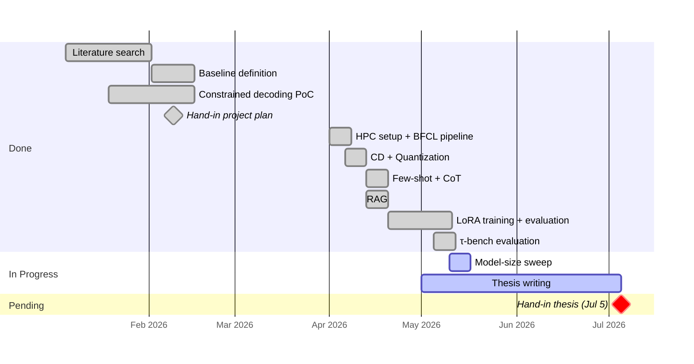

# Agents with Small Language Models

DTU Master Thesis · Supervisor Meeting

<div class="meta">

**Paulo Beckhauser** · s242779 · Supervisor: Nicki · May 11, 2026

</div>

---

# What am I doing?

SLMs can't call tools reliably out of the box. I am testing some techniques in order to improve that.

- **Model**: Qwen 2.5 7B Instruct
- **Benchmarks**: BFCL (400 single-function calls) + τ-bench (115 multi-turn retail tasks)
- **Task**: given a user query + function schema, produce the correct call

A small model handles simple tool calls, and a frontier model (e.g. GPT-4.1) takes over when the SLM fails. The goal is to expand the boundary of what the SLM can handle reliably, reducing how often the expensive fallback is needed.

| Query | Expected call |
|---|---|
| *"What is the GCD of 12 and 15?"* | `math.gcd(num1=12, num2=15)` |
| *"Find pediatrics hospitals within 5 miles of Denver"* | `hospital.locate(location='Denver, Colorado', radius=5, department='pediatrics')` |

---

# Method 1: No Constrained Decoding

Qwen 2.5 7B Instruct runs with no output format enforcement. The model generates free-form text and is expected to produce a valid function call on its own.

**What was done:** Standard chat inference. The user query and function schema are passed as a prompt; the model generates whatever it considers a plausible reply.

**Result:** **1.5% accuracy**

Establishes the floor. Raw SLMs cannot reliably format tool calls without structural guidance. Nearly every output is malformed or semantically wrong.

---

# Method 2: Constrained Decoding (CD)

Token generation is constrained at each step to only tokens consistent with a valid JSON function call matching the target schema, using the `outlines` library.

**What was done:** At inference time, a grammar derived from the function schema is used to mask invalid tokens. The model can only produce outputs that parse correctly.

**Example:** query *"What is the GCD of 12 and 15?"*, schema `math.gcd(num1: int, num2: int)`

```
Without CD → "I'll compute GCD(12, 15) = 3"                             ✗ unparseable
With CD    → {"name": "math.gcd", "arguments": {"num1": 12, "num2": 15}} ✓
```

After generating `"num1": `, the grammar only allows digit tokens, so `"twelve"` or `12.0` are impossible.

| Config | Accuracy | vs. CD |
|--------|----------|--------|
| No constrained decoding | 1.5% | — |
| **Constrained decoding (CD)** | **72.75%** | baseline |

A 71 pp jump. CD is the foundation for all subsequent experiments.

---

# Method 3: Quantization (AWQ INT4)

The model weights are compressed from FP16 to INT4 using Activation-aware Weight Quantization (AWQ), reducing memory footprint by roughly 4×.

**What was done:** The quantized checkpoint is loaded instead of the full-precision one; everything else (CD, prompt) is identical. The question is whether compression degrades tool-call accuracy.

| Config | Accuracy | vs. CD |
|--------|----------|--------|
| CD (baseline) | 72.75% | — |
| **CD + Q (AWQ INT4)** | **72.25%** | **−0.5 pp** |

Accuracy loss is negligible. Quantization is effectively free for this task.

---

# Method 4: Few-Shot Prompting

Three worked examples of (query → correct function call) are prepended to the system prompt before the actual question.

**What was done:** Examples were sampled from the BFCL training set to be representative of the schema type. The hypothesis was that seeing correct examples would help the model infer expected argument style.

| Config | Accuracy | vs. CD |
|--------|----------|--------|
| CD (baseline) | 72.75% | — |
| **CD + few-shot** | **70.25%** | **−2.5 pp** |

Slightly negative. CD already enforces format, so the examples add context noise without helping argument values.

---

# Method 5: Chain-of-Thought (CoT)

The model is prompted to write a brief reasoning step before producing the function call.

**What was done:** The system prompt instructs the model to think step by step about the query and then emit the call. The reasoning prefix is generated freely; CD then constrains only the final call.

| Config | Accuracy | vs. CD |
|--------|----------|--------|
| CD (baseline) | 72.75% | — |
| **CD + CoT** | **65.5%** | **−7.25 pp** |

Negative. The model reasons itself into wrong answers: 24 gains, 50 losses. Common errors: unit conversion confusions (10% → 10.0 or → 0.05) and date format changes.

---

# Method 6: RAG (Top-5 Retrieval)

The five most similar function schemas from a corpus are retrieved and injected into the context alongside the actual target schema.

**What was done:** Schemas are embedded with a sentence transformer; at inference time, the top-5 nearest neighbours are prepended to the prompt. The hypothesis was that analogous schemas would help the model understand argument patterns.

| Config | Accuracy | vs. CD |
|--------|----------|--------|
| CD (baseline) | 72.75% | — |
| **CD + RAG** | **47.75%** | **−25 pp** |

Large drop. Retrieved schemas are similar-but-wrong and actively compete with the real schema, confusing argument names and types.

---

# Method 7: LoRA Fine-Tuning

A LoRA adapter is trained on the BFCL training split. Three variants were tested to isolate what determines success.

**What was done:** Adapters trained on raw BFCL data (misaligned output format) and on a cleaned split where training labels match the exact inference format (format-aligned). Evaluated with and without CD.

| Config | Accuracy | vs. CD |
|--------|----------|--------|
| + LoRA (misaligned format) | 69.75% | −3 pp |
| LoRA only (no CD, no Q) | 13.75% | — |
| + LoRA (format-aligned, no CD) | 13.25% | — |
| **CD + format-aligned LoRA** | **76.75%** | **+4 pp (best)** |
| CD + Q + format-aligned LoRA | 74.25% | +1.5 pp |

Training data format must match inference format exactly. With alignment and CD combined, LoRA is the only technique that surpasses the CD baseline.

---

# Results summary

| Config | Accuracy | vs. CD baseline |
|--------|----------|----------------|
| No constrained decoding | 1.5% | — |
| Constrained decoding (CD) | 72.75% | baseline |
| + Quantization (AWQ INT4) | 72.25% | −0.5 pp |
| + Few-shot prompting | 70.25% | −2.5 pp |
| + Chain-of-thought | 65.5% | −7.25 pp |
| + RAG (top-5 retrieval) | 47.75% | −25 pp |
| + LoRA (misaligned format) | 69.75% | −3 pp |
| **CD + format-aligned LoRA** | **76.75%** | **+4 pp (best)** |
| CD + Q + format-aligned LoRA | 74.25% | +1.5 pp |

---

# Frontier comparison (BFCL Simple AST)

| Model | Accuracy |
|-------|----------|
| Gemini 3 Pro (Prompt) | 79.58% |
| Grok 4.1 Fast (FC) | 77.58% |
| **Qwen 2.5 7B + CD + LoRA** | **76.75%** |
| Claude Opus 4.5 (FC) | 76.83% |
| GPT-4.1 (FC) | 72.67% |
| **Qwen 2.5 7B + CD** | **72.75%** |
| Claude Sonnet 4.5 (FC) | 72.58% |
| Claude Haiku 4.5 (FC) | 71.00% |

With format-aligned LoRA, Qwen 2.5 7B approaches frontier models even on accuracy, not just format compliance.

<small>Source: <a href="https://gorilla.cs.berkeley.edu/leaderboard.html" target="_blank">BFCL v4 leaderboard</a>, Single Turn → Non-live (AST) column, April 2026</small>

---

# τ-bench: multi-step agentic tasks

BFCL measures format correctness of a single call. τ-bench measures end-to-end task completion across 5–15 turns. A task only passes if the final database state exactly matches ground truth. 9/10 steps correct still scores 0.

| Benchmark | What it tests | Pass rate |
|-----------|--------------|-----------|
| BFCL simple (CD) | Single call, format correctness | 72.75% |
| τ-bench retail (CD) | Multi-turn, end-to-end task completion | **4.35%** |

The **68 pp gap** is the central thesis finding: a model that formats tool calls correctly 72% of the time still fails almost every real agentic task. This quantifies the boundary the cascade architecture is designed to push.

---

# Model-size sweep (pending)

Running CD+Q, few-shot, CoT, RAG, and LoRA across Qwen 2.5 **0.5B / 1.5B / 3B**.

Submitted to HPC; results are pending. Questions: does CD close the format gap at every size? Does LoRA scale linearly with parameters?

---

# Next steps

- Model-size sweep results → fill Results section
- Deepen Discussion chapter (related work connections)
- Sharpen Introduction with final numbers
- Appendix: AI tool usage disclosure (Vancouver Convention)
- Pre-submission polish: figures, cross-references, bibliography



---
layout: statement
---

# Thank you
