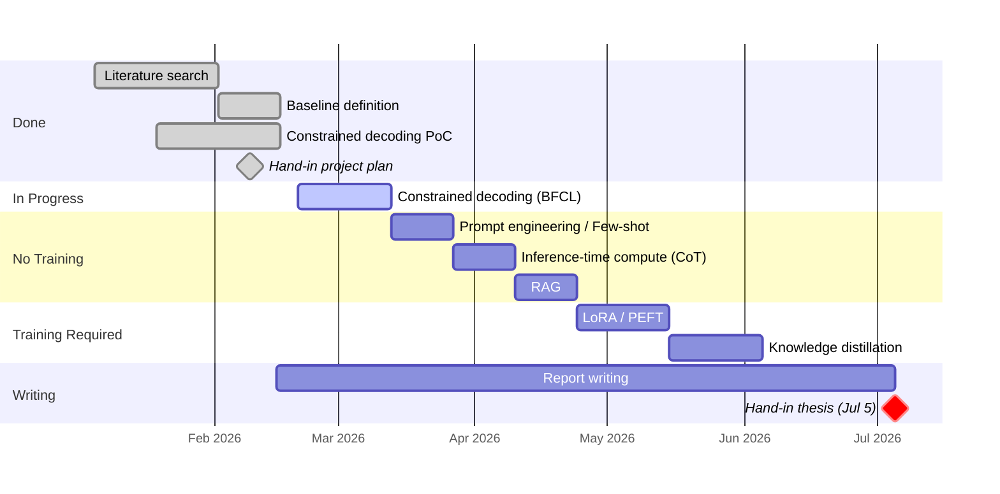

# Agents with Small Language Models

DTU Master Thesis · Supervisor Meeting

**Paulo Beckhauser** · s242779 · Supervisor: Nick · March 16, 2026

---
layout: section
---

# Context

## The core architecture challenge

---

# The challenge

- **SLMs struggle with agentic tasks.** Out of the box, small models fail at the core capabilities an agent needs: reasoning, tool use, and structured output.

- **Reasoning correctly.** The model must decompose tasks, decide when to call a tool vs. respond directly, and chain multi-step reasoning without hallucinating intermediate steps.

- **Calling the correct tools.** Select the right tool from a schema, produce valid arguments, and handle the result, all within constrained compute and latency budgets.

---
layout: statement
---

# Research Question

Which combination of *optimization techniques* enables a *small language model* to reason effectively and call the correct tools?

---

# Evaluation Metrics

| Category | Metric | Description |
|----------|--------|-------------|
| Tool Calling | **Tool Selection Accuracy** | Correct tool picked |
| | **Argument Accuracy** | Correct types and values |
| | **JSON Validity Rate** | Valid structured JSON output |
| | **Hallucination Rate** | Hallucinated names, extra/wrong fields |
| Reasoning | **Task Decomposition Accuracy** | All sub-tasks identified |
| | **End-to-End Task Success** | Full pipeline produces correct result |
| [BFCL](https://gorilla.cs.berkeley.edu/leaderboard.html) | **AST Accuracy** | Function call AST matches expected |
| | **Exec Accuracy** | Executed call produces correct result |

---
layout: section
---

# Methods

## Implementation Order

---

# Implementation Order

**Priority logic:** no-training methods first (cheapest, fastest), then training-required. Each method evaluated individually, and potentially in combination if time allows.

| # | Method | Status | Notes |
|---|--------|--------|-------|
| 0 | **Baseline Definition** | Done | Reference point. Unconstrained Qwen 2.5 3B |
| 1 | **Constrained Decoding** | In progress | Ensures valid output structure. Foundation for all others. |
| 2 | **Prompt Engineering / Few-shot** | To-do | Zero cost. Establishes what prompting alone can do. |
| 3 | **Inference-Time Compute** | To-do | No training. CoT/ReAct improves reasoning. |
| 4 | **RAG** | To-do | No training. Retrieves schemas, reduces hallucination. |
| 5 | **LoRA / PEFT** | To-do | Training required. Teaches tool-use directly. High impact. |
| 6 | **Knowledge Distillation** | To-do | Training required. Builds on LoRA pipeline. Needs API budget. |
| — | ~~Quantization~~ | Discarded | Efficiency only. Doesn't improve reasoning or tool calling. |
| — | ~~Pruning~~ | Discarded | Efficiency only. Likely degrades instruction-following. |

---
layout: section
---

# Progress

## Overall Status

---

# Overall Status

- ✅ **Project plan submitted.** Motivation, background, research question and Gantt chart delivered.
- ✅ **Literature reviewed.** Constrained decoding, LoRA/PEFT, quantization, pruning, knowledge distillation, RAG.
- 🔄 **Constrained decoding in progress.** PoC built on Qwen 2.5 3B. Running full BFCL evaluation.

---
layout: section
---

# Questions

## Technical & Operational discussion

---

# Technical discussion

- ❓ **Pareto approach to methods.** Instead of going deep on one method, evaluate each for improvement potential and invest time where the marginal gain is highest. Does this approach make sense for a thesis?
  A:

- ❓ **Do we always need an LLM?** For some tasks (e.g., deterministic routing, schema validation), an LLM is overkill. Could the architecture bypass the model entirely for certain task types? I want to create an architecture with a cascade mode(and use LLMs for more complex models). Does it makes sense my hypothesis?
  A:

- ❓ **Encoder-only(Bert) x Decoder-only(GPT)** For this situation maybe encoder can be better...?
  A:

---

# Operational discussion

- ❓ **Presentation**: When do we schedule the day? Is it better remote?
  A:

- ❓ **Final Document Submission**: Do you want(will have the availability) to read the document before submission?
  A: 

- ❓ **Code submission**: Github links? .zip? Each method implementation is a different repository right now
  A:

